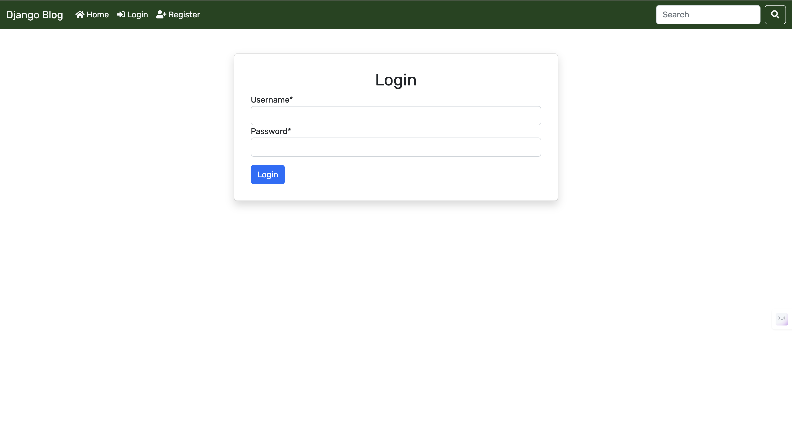
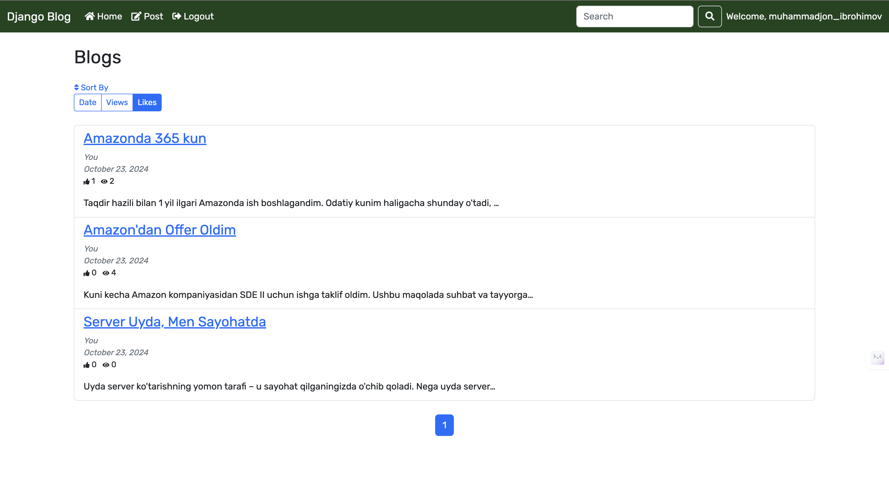
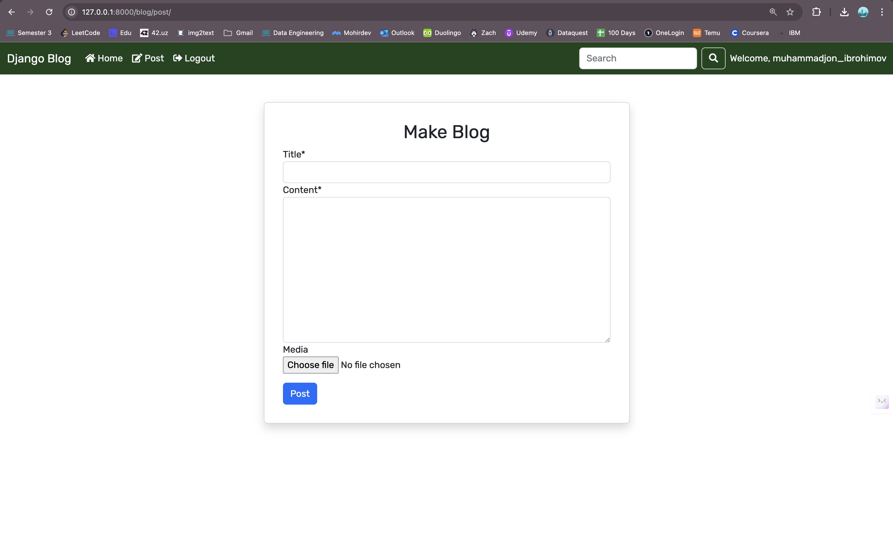
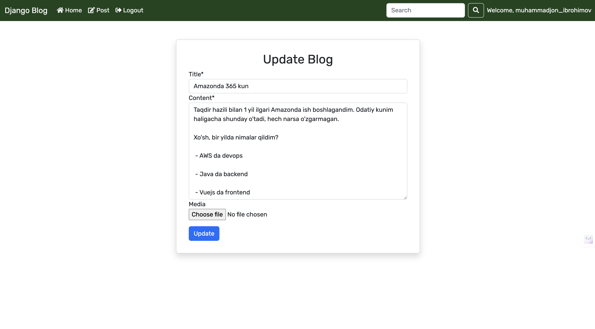
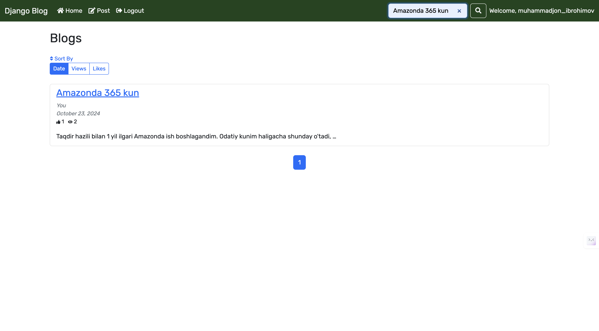
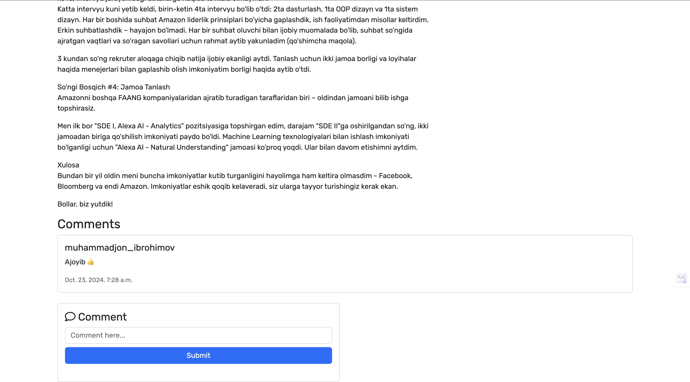

# Django Blog Project
## Introduction

Welcome to the Django Blog project documentation. This project is a feature-rich Django-based blog application that allows users to create, manage, and interact with blog posts. It provides a user-friendly interface for bloggers and readers alike. Whether you're a new Django developer or an end user, this documentation will help you get started with the project and explore its features.

## Getting Started

### Installation

Before you begin, make sure you have Python and Django installed on your system. To install Django, you can use pip:

```bash
pip install Django
```

### Project Setup

1. Clone the project repository from GitHub:

   ```bash
   git clone https://github.com/markcarcillar/django-blog.git
   ```

2. Navigate to the project directory:

   ```bash
   cd django-blog
   ```

3. Create a virtual environment (optional but recommended):

   ```bash
   python -m venv env
   ```

4. Activate the virtual environment:

   - On Windows:

     ```bash
     .\env\Scripts\activate
     ```

   - On macOS and Linux:

     ```bash
     source env/bin/activate
     ```

5. Install project dependencies:

   ```bash
   pip install -r requirements.txt
   ```

6. Run the development server:

   ```bash
   python manage.py runserver
   ```

7. Open your web browser and visit [http://localhost:8000/](http://localhost:8000/) to access the Django Blog project.

## Project Structure

The Django Blog project follows a standard Django project structure, with the following notable components:

- `core/`: The main Django app for managing blog posts and authentication (login, logout, register).
- `core/templates/`: HTML templates for rendering web pages.
- `media/`: Media files (uploaded images) associated with blog posts.
- `db.sqlite3`: The SQLite database file for storing project data.

## Usage

### User Registration and Authentication

- To create an account, click the "Register" link in the navigation menu.
- To log in, click the "Login" link in the navigation menu.
- Authenticated users can create their own blogs, comment on blogs, and like/unlike blogs.

### Blog Management

- On the home page, you can view the latest blog posts.
- Use the sorting options to arrange blog posts by date, views, or likes.
- Navigate through multiple pages of blog posts using pagination.

### Interaction

- Authenticated users can like or unlike blog posts without page reload.
- Users can also post comments on their own or other users' blog posts.

### Search

- Utilize the search form in the navigation menu to search for specific blog posts based on title, content, or author name.

## Additional Resources

- [Django](https://docs.djangoproject.com/en/4.2/): Official Django documentation
- [Bootstrap](https://getbootstrap.com/docs/5.2/getting-started/introduction/): Official Bootstrap documentation
- [Django REST Framework](https://www.django-rest-framework.org/): Official Django REST Framework documentation

## Project Dependencies

The Django Blog project relies on several external frameworks and libraries to enhance its functionality and appearance. Here are the key dependencies used in this project:

1. **Bootstrap and Fontawesome Icon (Frontend)**
2. **Django REST Framework (API)**
3. **Pillow (Media)**
4. **Django Crispy Forms (Form)**

These dependencies significantly contribute to the functionality and aesthetics of the Django Blog project, ensuring a seamless and visually appealing user experience.

Please note that detailed installation instructions for these dependencies can be found in the "Getting Started" section of this documentation.

## License

This project is licensed under the MIT License.

## Contributing

I welcome contributions from the developer community to help improve and grow the Django Blog project. Whether you're interested in fixing bugs, adding new features, improving documentation, or enhancing the user experience, your contributions are highly valuable.

## Contact

For support, feedback, or inquiries, please contact mj.ibrohimov@gmail.com

---

# Preview Photos of the Website:
 
  
  
  
 
  
  
  
